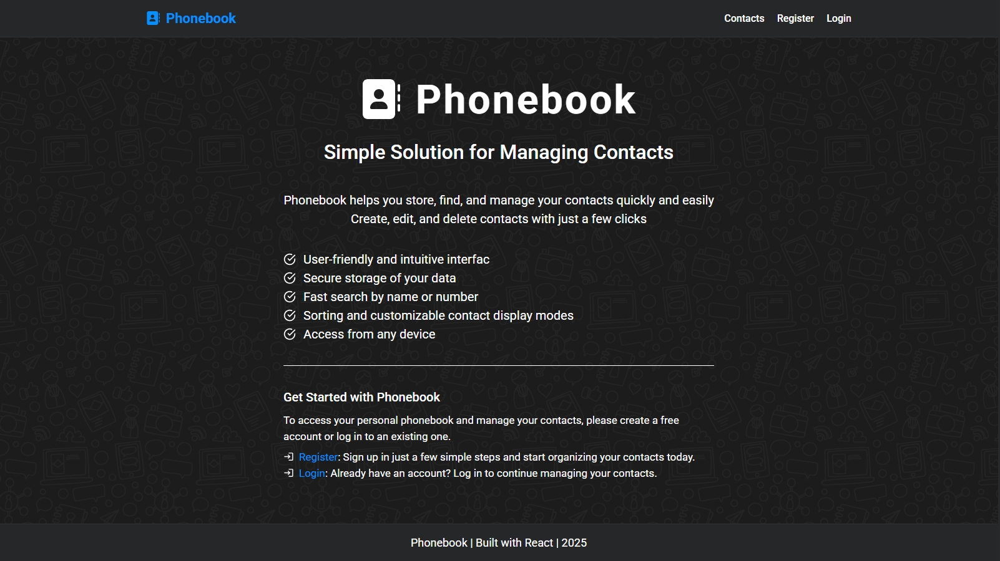

# Phonebook Application 📞

### React Application with Redux, Router, and Asynchronous Requests

## 🌐 Live Demo
🔗 [Phonebook App](https://goit-react-hw-08-one-henna.vercel.app/)

## 📂 GitHub Repository
🔗 [Phonebook Repository](https://github.com/Valentyn-M/Phonebook_goit-react-hw-08)

## 📖 About the Project
This application is a contact management system built with React, allowing users to:
- Register and authenticate securely.
- Add, edit, and delete contacts.
- Search for contacts using a live search feature.
- Sort contacts by name or by the date they were added.
- Switch between compact and expanded display modes.

## 🚀 Technologies Used
- **React.js** with Hooks
- **Redux Toolkit** for state management
- **React Router** for navigation
- **Axios** for handling API requests
- **React Helmet Async** for SEO optimization
- **Redux Persist** for state persistence
- **Formik + Yup** for form validation
- **React Modal** for modal windows
- **React Hot Toast** for notifications
- **Styled Components** for UI styling
